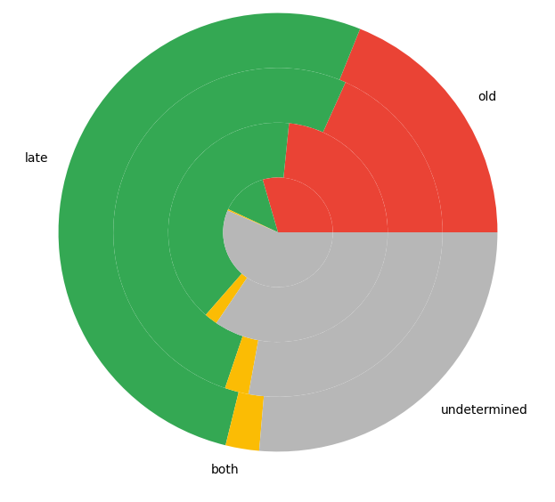
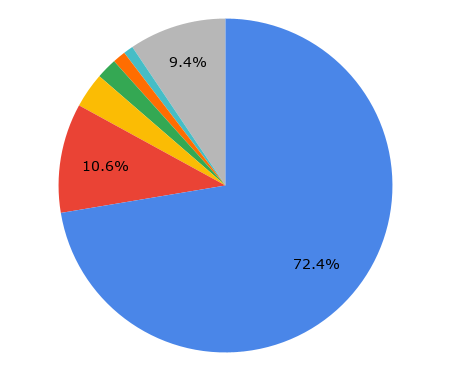

I am currently engaged with creating a catalogue of Khotanese texts. This would prove to be a rewarding endeavour, insofar as it allows texts and wordforms to be filtered by language variety (Old/Late), among other categories. A significant proportion of the corpus owes their labelling and charaterisation to [Guillocheau's database](https://khotanese.finug.eu). Although the website provides a number of .sql files for download, much processing remains to be done to format the database to a version I find easier to work with on a spreadsheet. `table_text.csv` has proven to be useful, but in matching the file labels[^1] (`KT3_12`) with the text names (`Lyrical poem (Lyr)`) I found it easier to work with a copy-and-paste of https://khotanese.finug.eu/index.sql.

<figure>
  
  <figcaption>Innermost to outermost: file, line, word, character counts.</figcaption>
</figure>

With Guillocheau's labels we have slightly less than two-thirds in (Latin transcriptional) character count, or three-fourths of the word count accounted for. The number of files, on the other hand, paint rather gargantuan picture of the task at hand: 933 files, or 56.5% of the total in the TITUS corpus (more on this in the postscript), remain to be labelled! To our relief, the files are disproportionately sized: just labelling the biggest 20 unlabelled texts (in word count) would allow us to account for 4.3% of the words, or 12.3% of the characters. A considerable amount of the text, both labelled and unlabelled are *fragments*: manuscripts, often literal fragments, that contain so little text to be useful for textual analysis.

<figure>
  
  <figcaption>What lies ahead (in word count): 
    <b>blue</b>, Labelled 
    <b>other colours</b>: Next 10 unlabelled texts 
    <b>grey</b>: Rest of corpus
  </figcaption>
</figure>

A label I think worthy of incorporation into a catalogue is the treatment of the vowel sign conventionally transcribed as *ä*. Per Hitch (2016, p. 102)[^2], the sign in Old Khotanese represents the value "/ĕ/, the short partner of e /ē/, while for Emmerick and Maggi 1991, if I have understood correctly, represents two low or low mid vowels, whose height is lower than that of ä. Emmerick 2009 treats ä as /ə/ and e as denoting long and short /ē, e/ (382)." In Late Khotanese the vowel, along with *i*, *e*, and *ai*, tends to merge into /e/ when stressed, and thus in the aforesaid condition only rarely, if ever, represented with *ä*. The sign however remains in fairly frequent use to represent unstressed /ə/ resulting from the weakening of any vowel, though here it alternates with *i* and *e*, and to a much lesser extent *ai*. 

Some Late Khotanese writers have done away with *ä*, leaving behind the unsigned *kāra* oft-transcribed as *Ca*. This is something to be taken into account in corpus analysis, for e.g. *jasta* 'lord' might either underlie older sg. *gyastä* or pl. *gyasta*. To this end I introduce a category `ae type`:
- absent
- sporadic: ä / total character count < ~2% (exact percentage to be determined)
- present
- fragment: see above

Another task for the future: compute akṣara counts, which I deem the most representative of the "visual" size of the texts.

Postscript: a handful of files in KBT + KT1-5 + Z are not included in the TITUS corpus. This matter will be discussed in another post. For now, it suffices to note that while some of these files are not included for various reasons, including: those mostly written in another languages (as a rule non-Khotanese parts of the texts are totally omitted from TITUS), abecedaries (or, more precisely speaking, *akakhagaries*), extremely fragmentery manuscripts; some are well-formed texts whose exclusion from TITUS remains to be investigated.

[^1]: Each 'file' constitute a single page in the TITUS corpus (mostly hailing from the sections in the prints). These occassionally diverge from manuscript and textual boundaries.
[^2]: Hitch, Douglas A. 2016. The Old Khotanese Metanalysis. Doctoral dissertation, Harvard University, Graduate School of Arts & Sciences.